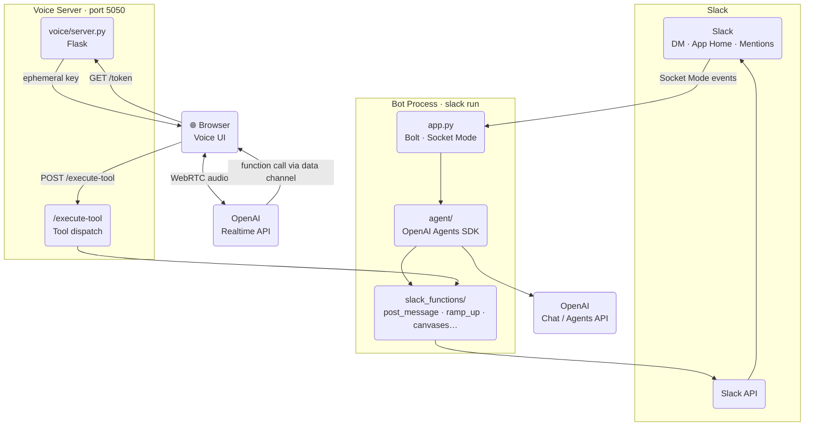

# Awesome EA

Awesome EA is a real-time voice AI executive assistant built on top of Slack. Connect it to your workspace and start a morning huddle: it greets you, catches you up across every key channel, and stays on the line to take action — sending messages on your behalf, setting reminders, drafting canvases, and remembering your preferences across sessions. Everything happens through natural conversation, so you can comfortably start your day by clearing low-level communication with ease. Every step is legible and clearly communicated, keeping you in control — and it collects feedback and learns from you over time.

<a href="https://youtu.be/zZA_D61BFc0">

</a>

▶ [Watch the demo on YouTube](https://youtu.be/zZA_D61BFc0)

**Live demo:** [awesomeea-slack-production.up.railway.app](https://awesomeea-slack-production.up.railway.app)

## Features

> Built on the [Slack Developer Sandbox](https://agentic-sandbox-test.enterprise.slack.com) — a free, isolated Slack workspace for prototyping and testing Slack apps without affecting a production workspace.

- **Voice huddle** — WebRTC real-time conversation via OpenAI Realtime API
- **Morning check-in** — bot DMs a greeting with a huddle link each morning
- **Channel ramp-up** — catches you up on unread messages across key channels
- **Actions** — send Slack messages, set reminders, create/edit/delete canvases
- **Memory** — learns preferences from conversations, updates your App Home
- **DM replies** — text chat with the agent directly in Slack

## Architecture



## Setup

### 1. Install dependencies

```bash
python -m venv .venv
source .venv/bin/activate
pip install -e .
pip install flask requests  # voice server extras
```

### 2. Create `.env`

```env
SLACK_BOT_TOKEN=xoxb-...
SLACK_APP_TOKEN=xapp-...         # Socket Mode token
SLACK_USER_TOKEN=xoxp-...        # For user-context actions (ramp-up, search)
SLACK_TEAM_ID=T...
OPENAI_API_KEY=sk-...
VOICE_PAGE_URL=https://your-ngrok-url.ngrok-free.app
DEMO_USER_ID=U...                # Your Slack user ID
GREET_ON_STARTUP=true            # Send morning greeting on app start
DEV_TOOLS=true                   # Enables /ea-reset command
```

### 3. Required Slack scopes

**Bot:** `app_mentions:read`, `channels:history`, `chat:write`, `chat:write.customize`, `groups:history`, `im:history`, `im:read`, `im:write`, `reactions:write`, `users:read`, `reminders:write`, `canvases:read`, `canvases:write`, `channels:read`, `channels:join`, `files:read`

**User:** `channels:history`, `groups:history`, `im:history`, `search:read`, `chat:write`, `canvases:read`, `canvases:write`, `users:read`, `reminders:write`

Enable **Socket Mode** and subscribe to bot events: `app_home_opened`, `app_mention`, `message.im`.

## Running

The voice server is deployed on Railway — no ngrok needed. Just run the Slack bot locally:

```bash
# Terminal 1 — Slack bot
slack run
```

The "🎧 Morning Huddle" button in Slack will open the live voice UI at [awesomeea-slack-production.up.railway.app](https://awesomeea-slack-production.up.railway.app) on any device.

<details>
<summary>Running the voice server locally (optional)</summary>

```bash
# Terminal 2 — Voice server
python voice/server.py

# Terminal 3 — Expose voice UI via ngrok
ngrok http 5050
```

~~Copy the ngrok URL → set `VOICE_PAGE_URL` in `.env` → restart `voice/server.py`.~~

</details>

## Slash Commands

| Command         | Description                                                      |
| --------------- | ---------------------------------------------------------------- |
| `/ea-reset`     | Clear DM history and resend greeting (`DEV_TOOLS=true` required) |
| `/ea-reset all` | Also wipes preferences and App Home                              |

## Dev

```bash
ruff check .   # lint
pytest         # tests
```
